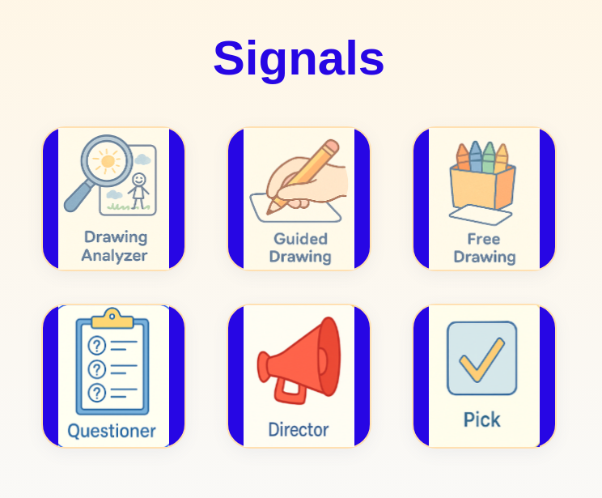
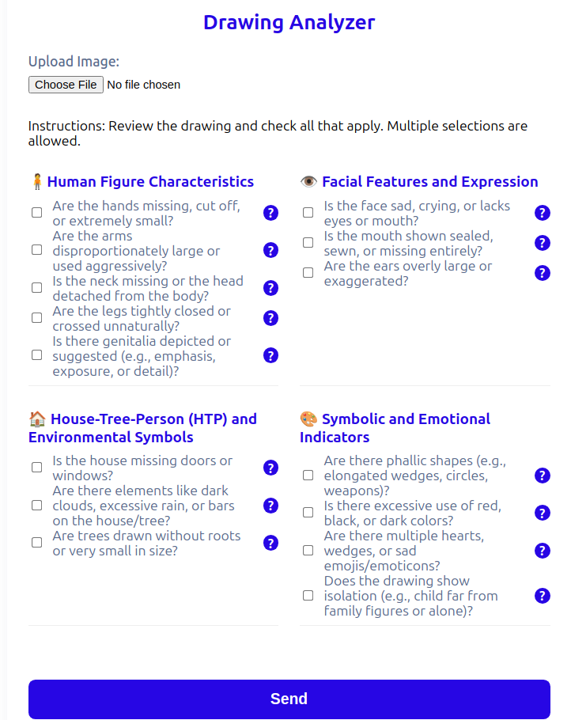
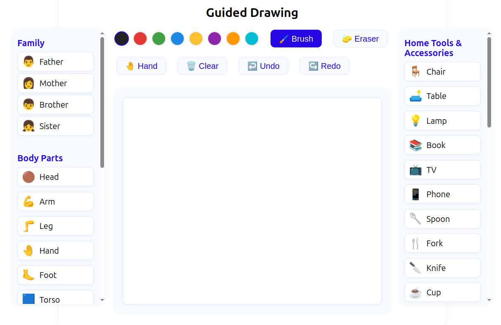
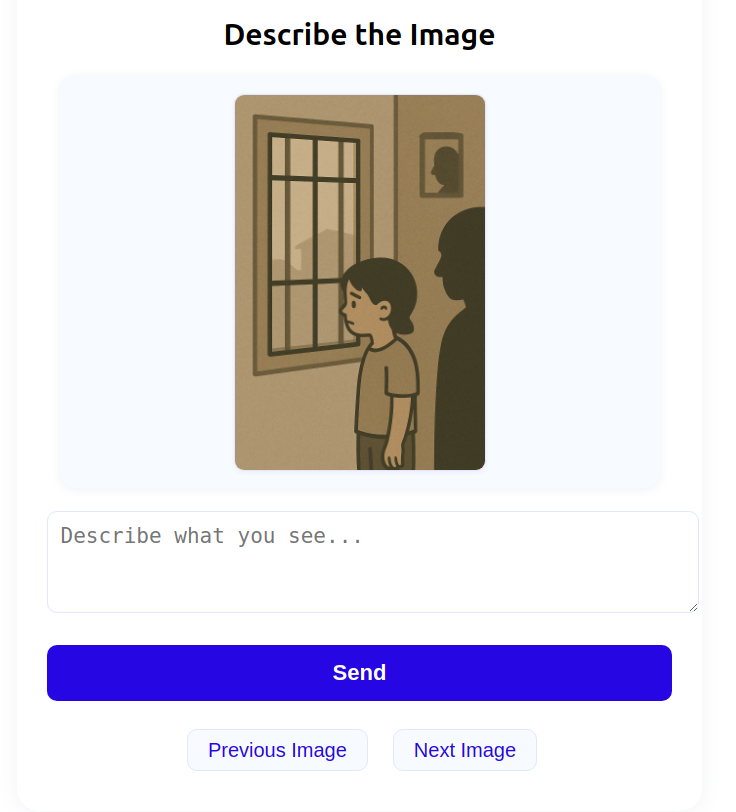

# signals


# Drawing Analyzer

This project deploys a full-stack AI-powered system to analyze children's drawings for behavioral indicators. It includes a React frontend, a FastAPI backend, and an Ollama server running a vision-capable LLM model (`llama3.2-vision`).


## Sample screens






## Architecture


                     
# Deployment Guide

## 🪟 Windows Local Development

### 📦 Requirements

- Windows 10/11
- At least 16GB RAM recommended
- **Python 3.11** (NOT 3.12 - download from [python.org](https://www.python.org/downloads/release/python-3119/))
- Node.js 18+ and npm

---

### ⚙️ Quick Setup with Batch Files (Recommended)

For a quick automated setup, use the provided batch files:

```powershell
# 1. Run the setup script (creates venv and installs dependencies)
.\setup-windows.bat

# 2. Start the backend server (in one terminal)
.\run-backend.bat

# 3. Start the frontend (in another terminal)
.\run-frontend.bat

# 4. Stop all servers when done
.\stop-servers.bat
```

---

### ⚙️ Manual Step-by-Step Setup for Windows

#### 🔹 1. Install Python

Download and install Python from [python.org](https://www.python.org/downloads/)

Verify installation:

```powershell
python --version
```

---

#### 🔹 2. Install Node.js

Download and install Node.js from [nodejs.org](https://nodejs.org/) (LTS version recommended)

Verify installation:

```powershell
node -v
npm -v
```

---

#### 🔹 3. Install Ollama for Windows

Download and install Ollama from [ollama.com](https://ollama.com/download/windows)

After installation, Ollama will run as a Windows service automatically.

Pull the required model:

```powershell
ollama pull llama3.2-vision
```

Verify Ollama is running:

```powershell
ollama list
```

---

#### 🔹 4. Clone the Project

```powershell
git clone https://github.com/your-username/drawing-analyzer.git
cd drawing-analyzer
```

---

#### 🔹 5. Set Up Python Backend (FastAPI)

Create and activate a virtual environment:

```powershell
python -m venv venv
.\venv\Scripts\Activate.ps1
```

> **Note:** If you get an execution policy error, run:
> ```powershell
> Set-ExecutionPolicy -ExecutionPolicy RemoteSigned -Scope CurrentUser
> ```

Install dependencies (use --only-binary to avoid build issues):

```powershell
pip install --only-binary=:all: -r backend\requirements.txt
```

> **If you get an error about no matching distribution**, try installing without the flag:
> ```powershell
> pip install -r backend\requirements.txt
> ```

> **Troubleshooting Python 3.12 on Windows:** If you encounter persistent build errors with `pydantic-core`, consider using Python 3.11 instead, which has better wheel support. Download from [python.org](https://www.python.org/downloads/)

---

#### 🔹 6. Start the Backend Server

With the virtual environment activated:

```powershell
python -m uvicorn backend.image_analyzer.image_analyzer:app --host 0.0.0.0 --port 4001
```

> **Note:** Using `python -m uvicorn` ensures the correct Python environment is used

✅ Test in a new PowerShell window:

```powershell
curl http://localhost:4001/health
```

Or open in browser: `http://localhost:4001/health`

---

#### 🔹 7. Start the React Frontend

Open a new PowerShell window and navigate to the project directory:

```powershell
cd frontend
npm install --legacy-peer-deps
npm start
```

> **Note:** The `--legacy-peer-deps` flag is needed to resolve TypeScript peer dependency conflicts with react-scripts.

The frontend will automatically open in your browser at `http://localhost:3000`

---

#### 🔹 8. Using the Application

1. Open `http://localhost:3000` in your browser
2. Upload a child's drawing using the interface
3. The backend will analyze the image using the Ollama vision model
4. View the analysis results

---

### 🛑 Stopping Services

**Option 1: Use the stop script (Recommended)**
```powershell
.\stop-servers.bat
```

**Option 2: Manual stopping**
- To stop the backend server: Press `Ctrl+C` in the backend PowerShell window
- To stop the frontend: Press `Ctrl+C` in the frontend PowerShell window

**Note:** Ollama runs as a Windows service and doesn't need to be stopped.

---

### 💡 Tips for Windows Development

- Use Windows Terminal for a better command-line experience
- Keep the backend and frontend running in separate terminal windows
- The virtual environment needs to be activated each time you open a new terminal
- Backend logs will appear in the terminal window where uvicorn is running

---

# Linux/Ubuntu Deployment Guide

## 📦 Requirements

- Ubuntu 22.04+ (tested on GCP VM)
- At least 16GB RAM recommended
- Optional: NVIDIA GPU for faster inference

---

## ⚙️ Step-by-Step Installation

### 🔹 1. Update & Install Dependencies

```bash
sudo apt update
sudo apt install -y git curl nano python3 python3-venv lsof tmux
````

---

### 🔹 2. Install Node.js (for frontend)

```bash
curl -fsSL https://deb.nodesource.com/setup_20.x | sudo -E bash -
sudo apt install -y nodejs
node -v
npm -v
```

---

### 🔹 3. Install Ollama (for `llama3.2-vision` model)

```bash
curl -fsSL https://ollama.com/install.sh | sh
```

> If your VM has a GPU, install NVIDIA drivers first:

```bash
sudo ubuntu-drivers autoinstall
sudo reboot
nvidia-smi
```

Then start Ollama:

```bash
ollama serve &
```

Optional enhancement: you could make it more persistent using nohup:
```bash
nohup ollama serve > ~/ollama.log 2>&1 &
```


Pull the model:

```bash
ollama pull llama3.2-vision
```


# Start Ollama server

```bash
nohup ollama serve > ~/ollama.log 2>&1 &
```


---

### 🔹 4. Clone the Project

```bash
git clone https://github.com/your-username/drawing-analyzer.git
cd drawing-analyzer
```

---

### 🔹 5. Set Up Python Backend (FastAPI)

```bash
python3 -m venv venv
source venv/bin/activate
pip install -r backend/requirements.txt
```

Create `run-backend.sh`:

```bash
echo 'nohup venv/bin/uvicorn backend.image_analyzer.image_analyzer:app --host 0.0.0.0 --port 4001 > ~/backend.log 2>&1 &' > run-backend.sh
chmod +x run-backend.sh
./run-backend.sh
```

✅ Test:

```bash
curl http://localhost:4001/health
```

---

### 🔹 6. Run React Frontend

```bash
npm install --prefix frontend
nohup npm start --prefix frontend > ~/frontend.log 2>&1 &
```

Open in browser: `http://<VM_EXTERNAL_IP>:3000`

---

### 🔹 7. Allow Port Access in GCP (Optional)

If using GCP:

```bash
gcloud compute firewall-rules create allow-analyzer \
  --allow tcp:4001,tcp:3000 \
  --target-tags analyzer \
  --description="Allow Drawing Analyzer ports"
```

Then tag your VM with `analyzer`.

---

## ✅ Environment Variables (Optional)

For flexible deployment, configure:

```
REACT_APP_BACKEND_URL=http://<VM_EXTERNAL_IP>:4001
```

Then rebuild the frontend:

```bash
cd frontend
npm run build
```

---

## 🧪 Test the Flow

1. Upload an image in the frontend UI.
2. Backend calls Ollama with vision prompt.
3. Result is displayed as an analysis summary.

---

## 📄 Logs

```bash
tail -f ~/backend.log
tail -f ~/frontend.log
```

---

## 🛑 Stop Services

```bash
pkill -f uvicorn
pkill -f "npm start"
```

---

