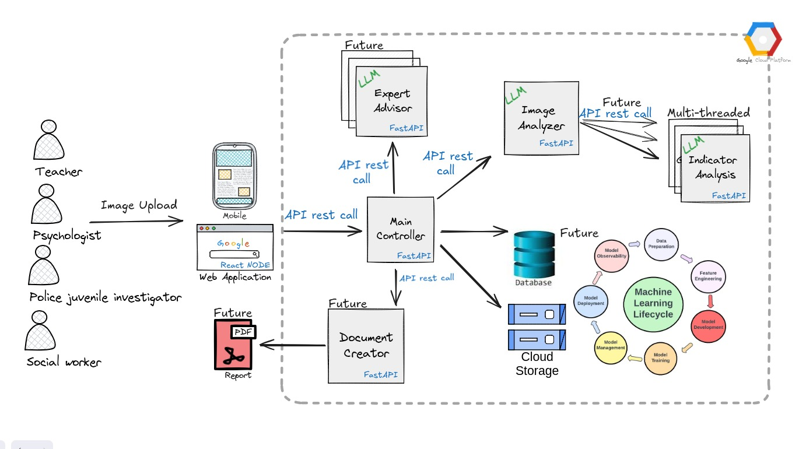

# signals


# Drawing Analyzer

This project deploys a full-stack AI-powered system to analyze children's drawings for behavioral indicators. It includes a React frontend, a FastAPI backend, and an Ollama server running a vision-capable LLM model (`llama3.2-vision`).


## Architecture


                     


#Deployment Guide

## 📦 Requirements

- Ubuntu 22.04+ (tested on GCP VM)
- At least 16GB RAM recommended
- Optional: NVIDIA GPU for faster inference

---

## ⚙️ Step-by-Step Installation

### 🔹 1. Update & Install Dependencies

```bash
sudo apt update
sudo apt install -y git curl nano python3 python3-venv lsof tmux
````

---

### 🔹 2. Install Node.js (for frontend)

```bash
curl -fsSL https://deb.nodesource.com/setup_20.x | sudo -E bash -
sudo apt install -y nodejs
node -v
npm -v
```

---

### 🔹 3. Install Ollama (for `llama3.2-vision` model)

```bash
curl -fsSL https://ollama.com/install.sh | sh
```

> If your VM has a GPU, install NVIDIA drivers first:

```bash
sudo ubuntu-drivers autoinstall
sudo reboot
nvidia-smi
```

Then start Ollama:

```bash
ollama serve &
```

Optional enhancement: you could make it more persistent using nohup:
```bash
nohup ollama serve > ~/ollama.log 2>&1 &
```


Pull the model:

```bash
ollama pull llama3.2-vision
```


# Start Ollama server

```bash
nohup ollama serve > ~/ollama.log 2>&1 &
```


---

### 🔹 4. Clone the Project

```bash
git clone https://github.com/your-username/drawing-analyzer.git
cd drawing-analyzer
```

---

### 🔹 5. Set Up Python Backend (FastAPI)

```bash
python3 -m venv venv
source venv/bin/activate
pip install -r backend/requirements.txt
```

Create `run-backend.sh`:

```bash
echo 'nohup venv/bin/uvicorn backend.image_analyzer.image_analyzer:app --host 0.0.0.0 --port 4001 > ~/backend.log 2>&1 &' > run-backend.sh
chmod +x run-backend.sh
./run-backend.sh
```

✅ Test:

```bash
curl http://localhost:4001/health
```

---

### 🔹 6. Run React Frontend

```bash
npm install --prefix frontend
nohup npm start --prefix frontend > ~/frontend.log 2>&1 &
```

Open in browser: `http://<VM_EXTERNAL_IP>:3000`

---

### 🔹 7. Allow Port Access in GCP (Optional)

If using GCP:

```bash
gcloud compute firewall-rules create allow-analyzer \
  --allow tcp:4001,tcp:3000 \
  --target-tags analyzer \
  --description="Allow Drawing Analyzer ports"
```

Then tag your VM with `analyzer`.

---

## ✅ Environment Variables (Optional)

For flexible deployment, configure:

```
REACT_APP_BACKEND_URL=http://<VM_EXTERNAL_IP>:4001
```

Then rebuild the frontend:

```bash
cd frontend
npm run build
```

---

## 🧪 Test the Flow

1. Upload an image in the frontend UI.
2. Backend calls Ollama with vision prompt.
3. Result is displayed as an analysis summary.

---

## 📄 Logs

```bash
tail -f ~/backend.log
tail -f ~/frontend.log
```

---

## 🛑 Stop Services

```bash
pkill -f uvicorn
pkill -f "npm start"
```

---

